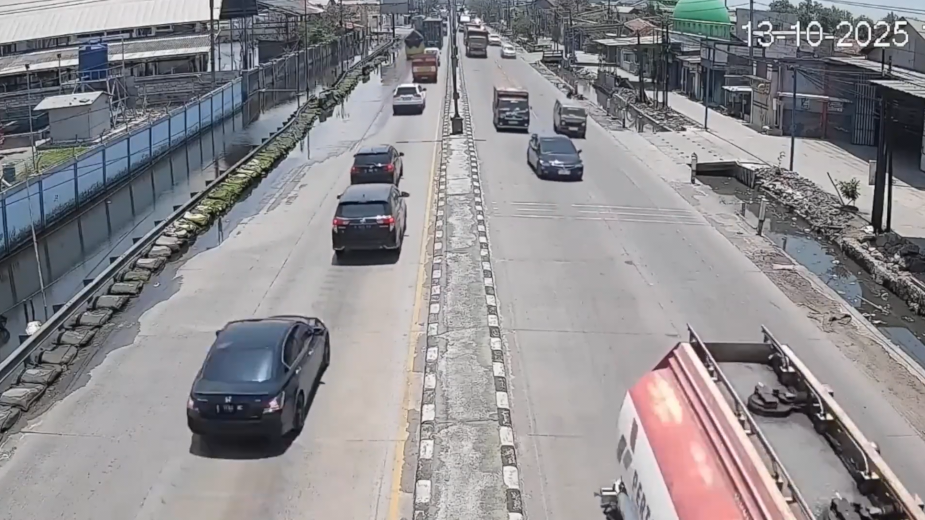
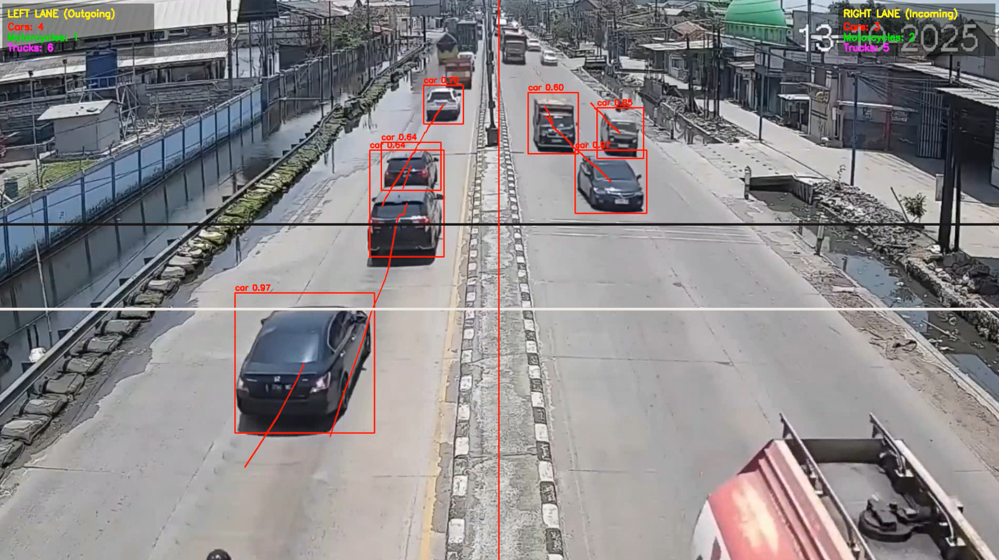

# YOLO Lane Vehicle Counter

Real-time **vehicle detection**, **tracking**, and **lane-based counting** using a **custom-trained YOLOv11 model** and **OpenCV**.

Trained on a custom dataset focused on detecting **cars**, **motorcycles**, and **trucks** for accurate traffic analysis.

---

## 🚀 Quick Start

### 1️⃣ Clone the Repository
```bash
git clone https://github.com/XSidik/yolo-lane-vehicle-counter.git
cd yolo-lane-vehicle-counter
```

### 2️⃣ Create and Activate a Virtual Environment
```bash
python3 -m venv .venv
source .venv/bin/activate   # On macOS/Linux
# .venv\Scripts\activate    # On Windows
```

### 3️⃣ Install Dependencies
```bash
pip install -r requirements.txt
```

### 4️⃣ Run the Application
```bash
cd src
python main.py
```

Once running, the application will:
- Open a video stream (or camera feed)
- Detect and track vehicles in real time
- Count **cars**, **motorcycles**, and **trucks** crossing each lane line

---

## 🧩 Description

This project performs **real-time vehicle detection, tracking, and lane-based counting** using a **YOLOv11 model** trained on a **custom dataset**.  
It is optimized for traffic monitoring applications such as:
- Intelligent transportation systems  
- Vehicle density estimation  
- Toll and road analytics  

Key components:
- **Custom-trained YOLOv11** model (focused on cars, motorcycles, and trucks)  
- **OpenCV** for video processing and visualization  
- Lane-based counting logic with object tracking  

You can easily customize:
- Lane positions and detection lines  
- Detection classes (car, motorcycle, truck)  
- Input sources (camera, video files, or streams)

---

## 🖥️ Requirements

- Python **3.8+**
- OpenCV
- PyTorch (with CUDA if available)
- ultralytics (for YOLOv11)
- NumPy

Install all dependencies automatically with:
```bash
pip install -r requirements.txt
```

---

## 🧠 Model Training

The YOLOv11 model was **trained manually** on a **custom vehicle dataset** containing cars, motorcycles, and trucks to achieve higher accuracy in real-world traffic scenes.

To retrain or fine-tune the model:
```bash
yolo train model=yolov11.pt data=data.yaml epochs=100 imgsz=640
```

After training, place your `best.pt` file inside the project directory and update `main.py`:
```python
model = YOLO("best.pt")
```

---

## 📊 Results

Below are example results showing vehicle detection, tracking, and counting in action.

| Before | After |
|------------|------------|
|  |  |

---

## 🧠 Notes

- To adjust detection confidence, modify the `conf` parameter in `main.py`.  
- To use a different video, change the input path in the code.  
- If a GPU is available, YOLOv11 automatically uses CUDA for faster inference.  

---

## 🤝 Contributing

Contributions are welcome!  
Feel free to open issues or submit pull requests to improve this project.

---

## 🪪 License

This project is released under the **MIT License** — free for personal and commercial use.

---

**Author:** [Nursidik](https://github.com/XSidik)
